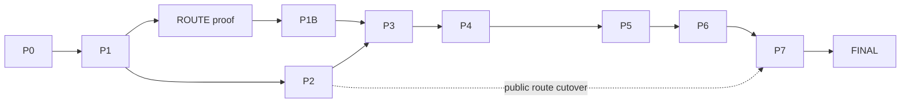

# 04 — PHASE DEPENDENCY MAP

```
P0 Baseline ─▶ P1 Foundation ─▶ ROUTE topology proof ─▶ P1B Auth Prototype ─┐
                    │                               │
                    ├──────────▶ P2 Catalog/SEO/Img ├─▶ P3 Auth+Forms ─▶ P4 Transactions ─▶ P5 Realtime ─▶ P6 Admin ─▶ P7 Cutover ─▶ FINAL
                    └── (P2 needs P1 only; P2 public cutover may precede P3 — no auth dependency)
```
Mermaid:


| Phase | Prereqs | Key outputs | Critical path | Parallelizable | Exit gate set (see 12) | Rollback checkpoint |
|---|---|---|---|---|---|---|
| P0 | none | baselines (SEO/perf/headers/env), safety-net tests, E2E skeleton | baselines | test authoring | QG-P0 | n/a (no prod change) |
| P1 | P0 | Next 16 skeleton (version-locked), CI, boundaries, ssr clients, next-intl [locale] architecture, composed proxy (PROXY-*), ROUTE topology proof, schemas, headers RO, observability, ADR-18 closure (SEC-014), DBMIG pipeline | i18n plugin + clients | lint/CI vs schemas | QG-P1 | delete app dir |
| P1B | P1 + **ROUTE-010 PASS** | 8-question auth interop verdict + ADR-17 closure (AUTHP-010) | prototype through REAL topology | — | QG-P1B (all questions + ADR-17 CLOSED) | preview-only |
| P2 | P1 | catalog RSC + ISR/tags + loader + metadata + sitemap + `*_ar` columns + 404/301 | product detail + tags | per-page builds | QG-P2 | restore route-group rewrite |
| P3 | P1B, P2(meta helpers) | cookie auth + bridge + forms handlers + Turnstile | callback handler + bridge | forms vs auth pages | QG-P3 | rewrite restore + bridge fallback |
| P4 | P3 | cart/checkout/quotes/requests + idempotency keys | request RPC integration | per-flow | QG-P4 | rewrite restore |
| P5 | P3 (session), P4 (request links) | chat + notifications on reliability protocol | reducer + message-id migration | chat vs notif | QG-P5 | rewrite restore |
| P6 | P2 (tags), P3 (auth), P5 (inbox realtime) | admin shell (role+MFA), interiors ported, revalidation wired | MFA + revalidate hooks | per-admin-page porting | QG-P6 | rewrite restore |
| P7 | all | full cutover, deletion ledger executed, bridge removed, CSP enforced | deletion order | — | QG-P7 | keep Vite deployable until FINAL passes |
| FINAL | P7 | independent re-audit report | — | — | QG-FINAL | — |

Blocked-task rule: a task may not start while any Blocking Dependency is not DONE. Cross-phase blockers are listed per task in `01`.

V2.1 note: P1B auth testing is INVALID unless run through the topology proven by ROUTE-001..010 — bridge/cookie behavior differs across rewrite layers.
